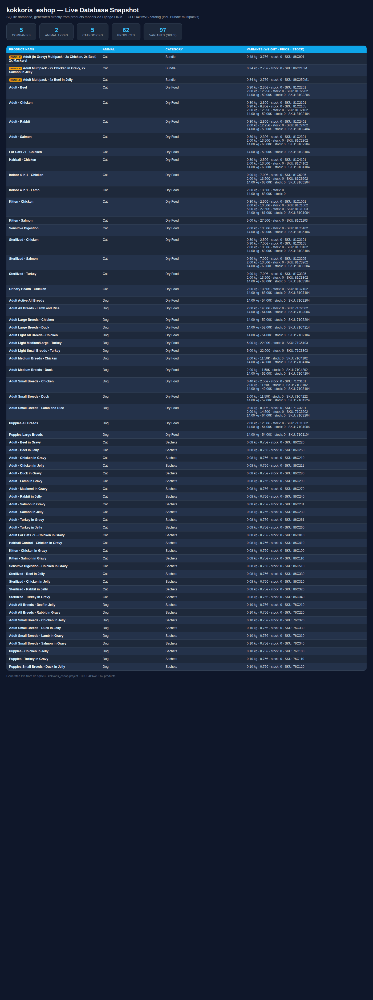
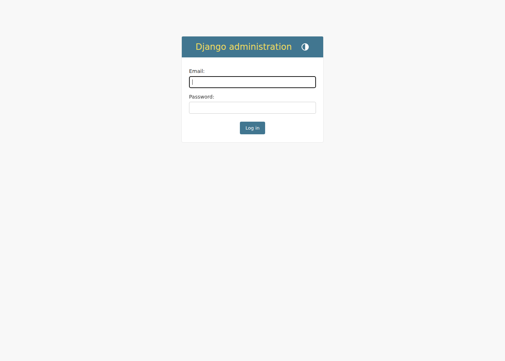

# kokkoris_eshop

Custom E-Commerce πλατφόρμα για είδη κατοικίδιων (τροφές, κονσέρβες, φακελάκια, άμμοι),
χτισμένη from scratch με **Python / Django** (backend, database) και **Tailwind CSS** (UI — έπεται στο Part 5).

Αυτό το αρχείο είναι το «ημερολόγιο» του project: εξηγεί **τι φτιάξαμε, γιατί το φτιάξαμε έτσι,
και πώς λειτουργεί** κάθε κομμάτι, ώστε να μπορείς ανά πάσα στιγμή να καταλάβεις την τρέχουσα
κατάσταση χωρίς να χρειαστεί να διαβάσεις όλο τον κώδικα.

Για τα ready-to-run scripts (management commands) και τις οδηγίες εκτέλεσής τους, δες το
[`SCRIPTS.md`](SCRIPTS.md).

---

## 0. Ιδιοκτησία & Έλεγχος Δεδομένων — Σημαντική Απόφαση

**Απόφαση:** Ο ιδιοκτήτης του project (εσύ) διατηρεί πλήρη κυριότητα και έλεγχο πάνω στη βάση
δεδομένων και το περιεχόμενο (προϊόντα, τιμές, εικόνες, stock) — **όχι** όποια εταιρεία/
προγραμματιστές αναλάβουν αργότερα το site. Ο στόχος είναι να παραμένεις σε θέση ισχύος:
όποιος χτίσει/φιλοξενήσει το τελικό site πρέπει να συνεργάζεται μαζί σου για κάθε προσθήκη ή
διόρθωση περιεχομένου, όχι να είσαι εσύ εξαρτημένος από αυτούς.

**Τι ισχύει ήδη προς αυτή την κατεύθυνση:**

- Το project folder και το Git repository βρίσκονται στο δικό σου μηχάνημα, όχι σε
  υποδομή τρίτου.
- Ο λογαριασμός Admin (`admin`) με πλήρη δικαιώματα είναι δικός σου.
- Η βάση (`db.sqlite3`) είναι ένα απλό, αυτόνομο αρχείο — δεν εξαρτάται από server άλλου.

**Τι να προσέξεις όταν συνεργαστείς με εταιρεία/developers στο μέλλον:**

1. **Repository:** Το Git repository (και το remote του, π.χ. στο GitHub) να παραμείνει στο
   **δικό σου** account. Δίνεις σε συνεργάτες πρόσβαση ως collaborators, όχι κυριότητα.
2. **Backups:** Να κρατάς τακτικά δικά σου αντίγραφα της βάσης (`db.sqlite3`, ή αργότερα το
   PostgreSQL dump στο Part 6) — ανεξάρτητα από το πού φιλοξενείται το site.
3. **Admin πρόσβαση:** Ο δικός σου λογαριασμός Admin να είναι πάντα ενεργός με πλήρη
   δικαιώματα, ώστε να μπορείς να προσθέτεις/διορθώνεις προϊόντα μόνος σου, χωρίς να
   περιμένεις κάποιον developer.
4. **Hosting/domain:** Το domain name και ο λογαριασμός hosting (π.χ. Render/DigitalOcean —
   Part 6) να είναι εγγεγραμμένα στο δικό σου όνομα/λογαριασμό, όχι της εταιρείας.
5. **Export δυνατότητα:** Επειδή όλα τα δεδομένα περνάνε από Django models με σαφή δομή,
   μπορείς ανά πάσα στιγμή να κάνεις export σε JSON/CSV (`python manage.py dumpdata products`)
   ώστε να μην είσαι ποτέ "κλειδωμένος" μέσα σε ένα συγκεκριμένο σύστημα.

---

## 1. Master Roadmap

| Part | Περιεχόμενο | Κατάσταση |
|---|---|---|
| **Part 1** | Foundation & Database (models, admin, data import) | ✅ Ολοκληρωμένο — CLUB4PAWS έτοιμο |
| **Part 2** | Authentication (Custom User, django-allauth) + Orders model | ✅ Ολοκληρωμένο (βλ. ενότητα 11) |
| **Part 3** | Core Engine (καλάθι, δυναμική τιμή, real-time stock) | ✅ Ολοκληρωμένο (βλ. ενότητα 12) |
| **Part 4** | Checkout & Payments (Orders, Stripe) | ✅ Ολοκληρωμένο (βλ. ενότητα 15) — πραγματική σύνδεση Stripe μένει για αργότερα |
| **Part 5** | UI/UX (Tailwind CSS, Django templates) | 🔄 Σε εξέλιξη — homepage mockup + catalog grid (βλ. ενότητα 16) · pagination/filters catalog pending |
| **Part 6** | QA & Deployment (PostgreSQL, Render/DigitalOcean) | ⏳ Δεν έχει ξεκινήσει |
| *(επιπλέον)* | Newsletter mailing list (`newsletter` app) | ✅ Ολοκληρωμένο (βλ. ενότητα 17) |
| *(επιπλέον)* | Wishlist / αγαπημένα (`wishlist` app) | ✅ Ολοκληρωμένο — guest session + σελίδα λίστας + nav icon (βλ. ενότητα 18) |
| *(επιπλέον)* | Auth modal + Google OAuth + password rules | ✅ Ολοκληρωμένο (βλ. ενότητα 11.2) |

---

## 2. Δομή του Project

```
kokkoris_eshop/
├── venv/                          # Python virtual environment (δεν μπαίνει στο Git)
├── core/                          # Django "project" — global ρυθμίσεις
│   ├── settings.py                # Όλες οι ρυθμίσεις (apps, database, media, allauth, κλπ.)
│   ├── urls.py                    # Κεντρική διανομή URLs (admin/, accounts/, media/, κλπ.)
│   ├── wsgi.py / asgi.py          # Entry points για production servers
│   └── __init__.py
├── products/                      # Django "app" — ό,τι αφορά προϊόντα/κατάλογο
│   ├── models.py                  # Τα 5 database models (βλ. ενότητα 4)
│   ├── admin.py                   # Ρυθμίσεις Django Admin (list_display, filters, κλπ.)
│   ├── catalog.py                 # Helpers για catalog cards (τίτλος, stock display, default variant)
│   ├── context_processors.py      # is_homepage για placement πεταλουδών στο nav
│   ├── views.py                   # home, catalog pages, search JSON
│   ├── urls.py                    # /products/all/, dogs, cats, brands, search
│   ├── migrations/                # Ιστορικό αλλαγών στη δομή της βάσης
│   └── management/commands/       # seed_data, import_club4paws, link_photos, import_company_logos,
│                                  # fix_product_names, set_initial_stock
├── accounts/                      # Django "app" — Custom User + προφίλ πελάτη (Part 2)
│   ├── models.py                  # CustomUser (email login) + CustomUserManager
│   ├── forms.py                   # ProfileForm, SignupForm (password hints)
│   ├── adapters.py                # django-allauth account/social adapters
│   ├── google_oauth.py            # KokkorisGoogleProvider (redirect URI από .env)
│   ├── password_help.py           # 2 κανόνες κωδικού (μήκος + ψηφίο)
│   ├── password_validators.py     # DigitValidator για AUTH_PASSWORD_VALIDATORS
│   ├── context_processors.py      # auth_modal context (αν χρειαστεί)
│   ├── views.py                   # profile_view + JSON login/signup/password reset API
│   ├── admin.py                   # CustomUserAdmin
│   ├── urls.py                    # /accounts/profile/ + auth JSON endpoints
│   └── management/commands/
│       ├── setup_oauth.py         # Συγχρονισμός Google SocialApp από .env
│       └── check_oauth.py         # Διάγνωση redirect URI / credentials
├── orders/                        # Django "app" — Παραγγελίες (Part 2, "ζωντάνεψε" στο Part 4)
│   ├── models.py                  # Order (πλήρες πλέον, βλ. ενότητα 15) + OrderItem
│   ├── views.py                   # cancel_order_view (ακύρωση παραγγελίας από τον πελάτη)
│   ├── urls.py                    # /orders/<id>/cancel/
│   └── admin.py                   # OrderAdmin (με inline OrderItems, list_editable status)
├── cart/                          # Django "app" — Καλάθι αγορών (Part 3, βλ. ενότητα 12)
│   ├── models.py                  # Cart (OneToOne με user) + CartItem — μόνιμη αποθήκευση
│   ├── cart.py                    # DBCart / SessionCart / get_cart() — η "καρδιά" της λογικής
│   ├── views.py                   # Cart HTTP API (add / update / status)
│   ├── urls.py                    # /cart/add/, /cart/update/, /cart/status/
│   ├── context_processors.py      # cart_total_items → badge στο nav
│   ├── signals.py                 # Merge guest καλαθιού → user καλάθι κατά το login
│   ├── admin.py                   # CartAdmin (με inline CartItems)
│   └── apps.py                    # Καταχωρεί το signals.py στο ready()
├── wishlist/                      # Django "app" — αγαπημένα (συνδεδεμένοι + guests)
│   ├── models.py                  # WishlistItem (user + product, unique)
│   ├── wishlist.py                # DBWishlist + SessionWishlist + get_wishlist()
│   ├── signals.py                 # Merge guest wishlist → user στο login
│   ├── context_processors.py      # wishlist_total_items → badge στο nav
│   ├── views.py                   # list page, toggle, status API (JSON)
│   └── urls.py                    # /wishlist/, /wishlist/toggle/, /wishlist/status/
├── checkout/                      # Django "app" — Checkout flow (Part 4, βλ. ενότητα 15)
│   ├── delivery.py                # is_within_athens_urban_area() + calculate_courier_fee()
│   ├── forms.py                   # CheckoutAddressForm, PaymentMethodForm
│   ├── views.py                   # checkout_address/delivery/payment_view + confirmation
│   └── urls.py                    # /checkout/address|delivery|payment|confirmation/
├── newsletter/                    # Django "app" — Mailing list για bulk emails (ενότητα 17)
│   ├── models.py                  # NewsletterSubscriber (email, is_active, timestamps)
│   ├── views.py                   # subscribe (POST από footer form)
│   ├── forms.py                   # NewsletterSubscribeForm (EmailField validation)
│   ├── admin.py                   # Λίστα + CSV export + mark unsubscribed
│   └── urls.py                    # /newsletter/subscribe/
├── templates/                     # HTML templates (Part 5 UI, βλ. ενότητα 16)
│   ├── base.html                  # Shell: Part 1 nav + Part 2 main + Part 3 footer
│   ├── page.html                  # Standard inner page — extends base, κενό hero/pre_footer
│   ├── home.html                  # Αρχική σελίδα (hero + about + animals — χωρίς product grid)
│   ├── accounts/profile.html      # Σελίδα προφίλ χρήστη
│   ├── checkout/                  # address, delivery, payment, confirmation (Part 4)
│   ├── products/                  # catalog.html, brands.html, partials (card, filters, toolbar)
│   ├── partials/
│   │   ├── nav.html               # Teal nav — search, filters, cart/wishlist/person icons
│   │   ├── auth-modal.html        # Modal σύνδεσης/εγγραφής + Google OAuth
│   │   ├── password_requirements.html  # Hints κάτω από πεδίο κωδικού
│   │   ├── hero.html              # Full-bleed hero collage (PDF page 1)
│   │   ├── hero-about.html        # "about us" κείμενο + brand carousel
│   │   ├── hero-brands.html       # Scrolling brand carousel (logos + pill buttons)
│   │   ├── hero-animals.html      # 4-pet photo strip πριν το footer
│   │   ├── footer.html            # Logo, legal links, newsletter, phone icon
│   │   └── cookie-consent.html
│   ├── wishlist/list.html         # Σελίδα αγαπημένων (guest + logged-in)
│   ├── socialaccount/
│   │   └── authentication_error.html  # Σελίδα σφάλματος Google OAuth
│   └── allauth/layouts/base.html  # Allauth → project base (ίδιο header/footer)
├── static/
│   ├── css/kokkoris-backgrounds.css
│   ├── css/site-scale.css         # Μόνιμο 90% scale (zoom) ολόκληρου site
│   ├── css/nav-layout.css         # Σταθερά px gaps στο header (zoom-stable)
│   ├── js/catalog.js              # Αγορά, stepper +/−, wishlist toggle στο catalog grid
│   ├── js/auth-modal.js           # Modal login/signup, Google redirect, password live check
│   ├── js/password-rules.js       # Live validation 2 κανόνων κωδικού
│   ├── js/newsletter-recaptcha.js
│   └── images/                    # Hero, butterflies, cart/wishlist/phone icons (λευκά)
├── media/                         # Uploaded εικόνες (προϊόντα, company logos, κλπ.)
├── docs/                          # Screenshots / snapshots τεκμηρίωσης
├── backups/                       # Αντίγραφα ασφαλείας βάσης/δεδομένων πριν από ρίσκες αλλαγές
├── db.sqlite3                     # Η ίδια η βάση δεδομένων (SQLite, για development)
├── manage.py                      # Το "τιμόνι" του Django — τρέχει όλες τις εντολές
├── requirements.txt               # Λίστα Python dependencies (συμπ. python-dotenv)
├── .env.example                   # Πρότυπο secrets (.env = gitignored, φορτώνεται αυτόματα)
├── .gitignore                     # Αρχεία που ΔΕΝ μπαίνουν στο Git
├── README.md                      # Αυτό το αρχείο
└── SCRIPTS.md                     # Τεκμηρίωση εντολών/scripts
```

---

## 3. Βήμα 1 — Setup του Workspace

Δημιουργήσαμε ένα απομονωμένο Python περιβάλλον ώστε τα dependencies του project να μην
μπερδεύονται με άλλα Python projects στο μηχάνημα:

1. **`python3 -m venv venv`** → δημιουργεί ένα «καθαρό» Python περιβάλλον μέσα στο φάκελο `venv/`.
2. **`source venv/bin/activate`** → ενεργοποιεί αυτό το περιβάλλον στο τρέχον terminal.
3. **`pip install django`** → εγκαθιστά το Django μέσα στο `venv`.
4. **`django-admin startproject core .`** → δημιουργεί τη βασική δομή του Django project
   (το τελικό `.` σημαίνει «εδώ», όχι σε νέο υποφάκελο).
5. **`.gitignore`** → λίστα αρχείων/φακέλων που δεν πρέπει ποτέ να μπουν στο Git
   (π.χ. `venv/`, `db.sqlite3`, `__pycache__/`, `.env`).
6. **`git init`** → αρχικοποιεί το repository για version control.

Από εκεί και πέρα, κάθε νέα βιβλιοθήκη που εγκαθιστούμε (`Pillow`, `unidecode`, `python-docx`)
καταγράφεται στο `requirements.txt` με `pip freeze > requirements.txt`, ώστε το project να
μπορεί να «στηθεί» ξανά σε οποιοδήποτε άλλο μηχάνημα με `pip install -r requirements.txt`.

---

## 4. Βήμα 2 — Σχεδιασμός της Βάσης Δεδομένων

### Η λογική πίσω από τα 5 models

Αντί για ένα μονολιθικό model `Product` με ένα πεδίο `category` τύπου κειμένου, χρησιμοποιήσαμε
**lookup tables** (πίνακες αναφοράς) για ό,τι επαναλαμβάνεται, ώστε να αποφύγουμε λάθη
πληκτρολόγησης και να διευκολύνουμε filtering/reporting αργότερα:

- **`Company`** — οι μάρκες (`Core`, `CLUB4PAWS`, `OWNAT`, `PROFINE`, `EVERCLEAN`, `Wild Side`, `Puro Instinto`).
  Κάθε μάρκα μπορεί να έχει `logo` (ImageField) για το homepage carousel.
- **`AnimalType`** — `Dog`, `Cat`.
- **`Category`** — `Dry Food`, `Canned Food`, `Sachets`, `Litter`.
- **`Product`** — το «γονικό» προϊόν: όνομα, μάρκα, ζώο, κατηγορία, περιγραφή, components, εικόνα.
- **`ProductVariant`** — κάθε *μέγεθος συσκευασίας* του ίδιου προϊόντος (π.χ. 2kg, 10kg, 15kg),
  με δικό του SKU, τιμή και απόθεμα (`stock`).

### Γιατί `Product` + `ProductVariant` και όχι ένα μόνο model;

Το ίδιο προϊόν (π.χ. "OWNAT Adult Medium") πωλείται σε πολλά μεγέθη, το καθένα με διαφορετική
τιμή και διαφορετικό διαθέσιμο απόθεμα, αλλά με **κοινή** περιγραφή/components/εικόνα.
Το να έχουμε ξεχωριστό `Product` για κάθε μέγεθος θα σήμαινε επανάληψη της ίδιας περιγραφής
πολλές φορές. Γι' αυτό:

- Το **`Product`** κρατάει ό,τι είναι *κοινό* για όλα τα μεγέθη.
- Το **`ProductVariant`** κρατάει ό,τι *διαφέρει* ανά μέγεθος (βάρος, τιμή, SKU, απόθεμα),
  και συνδέεται με `ForeignKey` πίσω στο `Product` (σχέση "ένα προς πολλά").

### Πώς λύθηκε το θέμα των ελληνικών χαρακτήρων στα slugs

Κάθε model έχει ένα `slug` πεδίο (π.χ. `dry-food` αντί για `Dry Food`) για χρήση σε URLs.
Το πρόβλημα: το προεπιλεγμένο `slugify()` του Django **σβήνει εντελώς** μη-λατινικούς
χαρακτήρες, οπότε ένα ελληνικό όνομα θα γινόταν κενό slug (`""`) — και αφού τα slugs πρέπει
να είναι μοναδικά, το δεύτερο κενό slug προκαλούσε σφάλμα βάσης δεδομένων
(`UNIQUE constraint failed`).

Η λύση: η βιβλιοθήκη **`unidecode`** μετατρέπει πρώτα τους ελληνικούς χαρακτήρες σε λατινικούς
(π.χ. "Ξηρά Τροφή" → "3era Trofi"), και *μετά* εφαρμόζουμε το κανονικό `slugify()`. Αυτό
γίνεται στη helper function `generate_ascii_slug()` μέσα στο `products/models.py`, η οποία
καλείται αυτόματα από την `save()` κάθε model όταν δεν έχει ήδη οριστεί slug.

### Convention: Λατινικά vs Ελληνικά

Αποφασίσαμε ρητά:

- **Ονόματα προϊόντων, brands, κατηγορίες, κώδικας** → πάντα Λατινικοί χαρακτήρες (Αγγλικά),
  ώστε ο κώδικας/database/admin panel να είναι συνεπής και εύκολος στη διαχείριση.
- **`description`** και **`components`** (συστατικά) → παραμένουν στα **Ελληνικά**, γιατί
  απευθύνονται στον τελικό πελάτη και πρέπει να είναι ακριβή και κατανοητά στα ελληνικά.

---

## 5. Βήμα 3 — Django Admin

Το `products/admin.py` καταχωρεί όλα τα models στο Django Admin panel (`/admin/`), ώστε να
μπορούμε να προσθέτουμε/επεξεργαζόμαστε δεδομένα από ένα φιλικό γραφικό περιβάλλον χωρίς κώδικα.
Βασικά χαρακτηριστικά:

- **`list_display`** — ποιες στήλες φαίνονται στη λίστα εγγραφών.
- **`list_filter`** / **`search_fields`** — φίλτρα και αναζήτηση.
- **`prepopulated_fields`** — το πεδίο `slug` γεμίζει αυτόματα καθώς πληκτρολογείς το `name`.
- **`ProductVariantInline`** — επιτρέπει να προσθέτεις/επεξεργάζεσαι όλα τα μεγέθη
  (variants) ενός προϊόντος **μέσα** στην ίδια σελίδα του προϊόντος, χωρίς να χρειάζεται να
  πλοηγηθείς αλλού.

---

## 6. Βήμα 4 — Seed Data (αρχικά δεδομένα αναφοράς)

Πριν μπορέσουμε να εισάγουμε προϊόντα, χρειαζόμασταν τις βασικές εγγραφές αναφοράς
(`Company`, `AnimalType`, `Category`) να υπάρχουν ήδη στη βάση. Αυτό γίνεται με το custom
management command `seed_data` (δες [`SCRIPTS.md`](SCRIPTS.md) για οδηγίες εκτέλεσης).

Χρησιμοποιεί `get_or_create()` για κάθε εγγραφή, που σημαίνει ότι το command μπορεί να τρέξει
**πολλές φορές χωρίς πρόβλημα** (idempotent) — αν η εγγραφή υπάρχει ήδη, απλά την προσπερνάει
αντί να δημιουργήσει διπλότυπο ή να πετάξει σφάλμα.

---

## 7. Βήμα 5 — Εισαγωγή προϊόντων CLUB4PAWS από Word

Μας δόθηκε ένα ημι-δομημένο αρχείο Word (`OLA TA KEIMENA.docx`) με όλα τα προϊόντα CLUB4PAWS
(ονόματα, βάρη, τιμές, SKU, περιγραφές, components), γραμμένο σε ελεύθερη μορφή χωρίς σταθερή
δομή (π.χ. άλλοτε το SKU είναι πριν την τιμή, άλλοτε μετά· άλλοτε λείπει η ένδειξη πρωτεΐνης/
λίπους κλπ.).

### Πώς δουλεύει ο parser (`import_club4paws.py`)

Λειτουργεί σαν **state machine**: διαβάζει το docx παράγραφο-παράγραφο και αποφασίζει τι
«είναι» κάθε γραμμή:

1. **Header γραμμή** (π.χ. `OWNAT ADULT DOG SALMON`) → όλο κεφαλαία, χωρίς αριθμούς/€ →
   ξεκινάει νέο προϊόν.
2. **Variant γραμμή** (π.χ. `2kg – 8,90€ – SKU: 81C6202`) → matches ένα regex pattern με
   βάρος + τιμή (+ προαιρετικό SKU) → προστίθεται ως `ProductVariant` στο τρέχον προϊόν.
3. **Components γραμμή** (ξεκινάει με λέξεις-κλειδιά όπως "Σύνθεση:") → αποθηκεύεται ως
   `components`.
4. Οτιδήποτε άλλο κείμενο → μπαίνει στο `description`.

### Δυσκολίες που αντιμετωπίσαμε και πώς λύθηκαν

- **Ελληνικές λέξεις μέσα σε header γραμμές** (π.χ. "ΜΕ ΑΡΝΙ σε σάλτσα") μπέρδευαν τον έλεγχο
  "είναι όλο κεφαλαία;" → λύση: αφαιρούμε γνωστές ελληνικές φράσεις-«γέμισμα» πριν κάνουμε
  τον έλεγχο.
- **Homoglyphs** — Ελληνικά κεφαλαία γράμματα που *μοιάζουν* οπτικά με λατινικά (π.χ. ελληνικό
  "Α" αντί για λατινικό "A") έκαναν τις λέξεις να φαίνονται λάθος → λύση: πίνακας μετατροπής
  `GREEK_TO_LATIN_HOMOGLYPHS`.
- **Διπλότυπα SKU** στο ίδιο το αρχείο (`81C6202`, `81C6204` εμφανίζονταν 2 φορές σε
  διαφορετικά variants) → θα προκαλούσαν σφάλμα μοναδικότητας στη βάση → λύση: το δεύτερο
  αντίγραφο εισάγεται με SKU = κενό (`None`), ώστε να μπει το προϊόν στη βάση, με σημείωση
  για χειροκίνητη διόρθωση αργότερα.
- **Μεταφράσεις ονομάτων** — κάθε προϊόν μεταφράστηκε στα Αγγλικά (π.χ. "με αρνί" → "Lamb"),
  ενώ η περιγραφή/components έμειναν στα Ελληνικά.
- **Multipack / variety packs** — παραλείφθηκαν (δες ενότητα 9 παρακάτω).

Το command τρέχει πρώτα σε λειτουργία **`--dry-run`** (δείχνει τι θα γίνει, χωρίς να γράψει
τίποτα στη βάση) και μετά κανονικά, για ασφάλεια.

---

## 8. Τρέχουσα Κατάσταση Βάσης Δεδομένων (Live Snapshot)

Το παρακάτω screenshot δημιουργήθηκε **απευθείας από τα ζωντανά δεδομένα** της βάσης
(`db.sqlite3`) μέσω Django ORM query, τη στιγμή που γράφτηκε αυτό το README:



> **Σημείωση για το πώς παράχθηκε:** Το development server (`runserver`) δεν ήταν προσβάσιμο
> μέσω browser λόγω δικτυακού περιορισμού (το εργαλείο browser λειτουργεί σε διαφορετικό
> sandbox από το Django process). Αντί γι' αυτό, τραβήξαμε τα πραγματικά δεδομένα απευθείας
> από τη βάση με Django ORM, τα οπτικοποιήσαμε σε ένα στυλιζαρισμένο HTML και το μετατρέψαμε
> σε εικόνα τοπικά (headless Chrome). Τα νούμερα/προϊόντα στην εικόνα είναι 100% πραγματικά,
> ζωντανά δεδομένα — όχι mock data. Για να δεις το ίδιο μέσα από το κανονικό Admin UI, τρέξε
> `python manage.py runserver` και άνοιξε `http://localhost:8000/admin/` στον δικό σου browser
> (δες [`SCRIPTS.md`](SCRIPTS.md)).

**Τρέχοντα στατιστικά:**

| Οντότητα | Πλήθος |
|---|---|
| Companies | 7 (CLUB4PAWS, Core, OWNAT, PROFINE, EVERCLEAN, Wild Side, Puro Instinto) |
| Animal Types | 2 |
| Categories | 5 (Dry Food, Canned Food, Sachets, Litter, **Bundle**) |
| **Products (CLUB4PAWS)** | **62** (59 μονά προϊόντα + 3 bundles) |
| **Product Variants (SKUs)** | **97** |

> ⚠️ **Σημαντικό για το πεδίο `stock`:** Το πρωτότυπο αρχείο `OLA TA KEIMENA.docx` δεν περιείχε
> πραγματικούς αριθμούς αποθέματος. Αρχικά εισήχθησαν με `stock = 0`· τώρα το **default για νέα
> variants είναι `20`** και υπάρχει η εντολή `set_initial_stock` για μαζική ενημέρωση. Για
> production θα χρειαστούν οι πραγματικοί αριθμοί ανά SKU (Admin ή import αρχείου).

---

## 9. Τι είναι τα "Multipack / Variety Packs" — και πώς τα προσθέσαμε (Category: Bundle)

Στον κατάλογο, ορισμένα προϊόντα δεν πωλούνται ως *ένα* μέγεθος συσκευασίας, αλλά ως
**πακέτο-συλλογή** πολλαπλών, μικρότερων συσκευασιών μαζί — συνήθως διαφορετικών γεύσεων —
πουλημένες σαν ένα ενιαίο εμπορικό προϊόν. Παράδειγμα πραγματικής περίπτωσης από το CLUB4PAWS:

> SKU `86C210Μ`: 4 x 85gr φακελάκια (2x Κοτόπουλο σε σάλτσα, 2x Σολομός σε ζελέ), 2.75€

Δηλαδή δεν είναι *ένα* μέγεθος του ίδιου προϊόντος (όπως το 2kg/10kg/15kg ενός ξηρού τροφής),
αλλά ένα **σύνολο** διαφορετικών γεύσεων, πακεταρισμένο και πωλούμενο μαζί με ενιαία τιμή και
δικό του SKU.

### Πώς το λύσαμε τελικά

Προσθέσαμε μια **5η κατηγορία, `Bundle`**, στο `Category` lookup table (η απλή λύση από τις
δύο που είχαμε συζητήσει, κατάλληλη για την τρέχουσα φάση του project). Κάθε multipack γίνεται
ένα κανονικό `Product` με `category = Bundle`, μαζί με:

- **`variants`**: ένα μοναδικό `ProductVariant` με weight = το *συνολικό* βάρος του πακέτου
  (π.χ. 4 x 85gr = 0.34kg), price = η προτεινόμενη τιμή λιανικής, και το δικό του SKU.
- **`description`** (Ελληνικά, για τον πελάτη): π.χ. *"Περιέχει: 2χ Κοτόπουλο σε σάλτσα,
  2χ Σολομός σε ζελέ."*
- **`bundle_contents`** (νέο πεδίο, Λατινικοί χαρακτήρες, ίδια λογική με το `name`): μια σύντομη,
  δομημένη περίληψη του περιεχομένου, π.χ. *"2x Chicken in Gravy, 2x Salmon in Jelly"* — χρήσιμο
  για γρήγορη ανάγνωση στο admin χωρίς να χρειάζεται να διαβάσεις όλη την ελληνική περιγραφή.

Έτσι προστέθηκαν **3 νέα bundle προϊόντα** στη βάση (τα οποία αρχικά παραλείπονταν από τον
parser), χωρίς να πειραχτεί κανένα από τα υπόλοιπα 59.

### Ο περιορισμός αυτής της απλής λύσης

Το bundle **δεν συνδέεται σχεσιακά** με τα μεμονωμένα προϊόντα-γεύσεις που περιέχει (π.χ. το
"2x Chicken in Gravy" μέσα στο bundle δεν είναι συνδεδεμένο με το πραγματικό `Product` "Adult -
Chicken in Gravy" που υπάρχει ήδη ξεχωριστά στη βάση). Είναι απλώς περιγραφικό κείμενο. Αυτό
σημαίνει ότι αν αργότερα χρειαστεί να μειώνεται αυτόματα το στοκ των επιμέρους γεύσεων όταν
πουλιέται ένα bundle (πραγματικό "real-time stock" στο Part 3), θα χρειαστεί η πιο σύνθετη λύση:
ένα νέο model `ProductBundle` με πραγματική many-to-many σχέση προς συγκεκριμένα
`ProductVariant` αντικείμενα. Θα το αποφασίσουμε μαζί όταν φτάσουμε εκεί.

---

## 10. Βήμα 6 — Σύνδεση Φωτογραφιών με τα Προϊόντα

Μας δόθηκαν δύο φάκελοι με φωτογραφίες προϊόντων: **"DOGS PHOTO"** και **"CATS PHOTO"**, όπου
κάθε αρχείο ονομάζεται σχεδόν πανομοιότυπα με το αντίστοιχο header του αρχικού εγγράφου Word
(π.χ. `ADULT SMALL BREEDS ΜΕ ΚΟΤΟΠΟΥΛΟ.png`).

### Πώς τις συνδέσαμε αυτόματα

Φτιάξαμε ένα νέο management command, **`link_photos`**, που:

1. Ξαναχρησιμοποιεί **τις ίδιες ακριβώς** συναρτήσεις καθαρισμού κειμένου (`clean_life_stage`,
   `clean_flavor`) που χρησιμοποιεί ήδη ο `import_club4paws`, για να ξαναφτιάξει το όνομα
   προϊόντος από κάθε filename — έτσι το αποτέλεσμα ταιριάζει αυτόματα με τα ονόματα που
   υπάρχουν ήδη στη βάση.
2. Για τα 3 bundle photos (ονομασμένα με το SKU τους, π.χ. `86C210Μ.png`), κάνει αντιστοίχιση
   απευθείας μέσω SKU.
3. Όταν το filename δεν έχει ακριβές match (π.χ. λείπει η κατάληξη "σε σάλτσα"/"σε ζελέ" από
   το όνομα αρχείου, ενώ υπάρχει μόνο στο αντίστοιχο Sachets προϊόν), δοκιμάζει έξυπνα αυτές
   τις παραλλαγές πριν τα παρατήσει.
4. Αναγνωρίζει ενδείξεις μεγέθους στο filename (π.χ. "100GR") σαν σημάδι ότι η φωτογραφία
   αφορά το μικρό φακελάκι (Sachets) και όχι τη σακούλα ξηράς τροφής, δίνοντας προτεραιότητα
   ανάλογα.
5. Ποτέ δεν αντικαθιστά μια φωτογραφία που έχει ήδη ανατεθεί σε ένα προϊόν μέσα στο ίδιο
   τρέξιμο — αν δύο αρχεία "διεκδικούν" το ίδιο προϊόν, κρατάει το πρώτο και αναφέρει το
   δεύτερο σαν πιθανό διπλότυπο/εναλλακτικό μέγεθος.

### Αποτέλεσμα

**Και τα 62 προϊόντα (59 μονά + 3 bundles) απέκτησαν φωτογραφία** — 60 μέσω αυτόματου
matching (ονόματος ή SKU) και 2 μέσω έξυπνης αντιστοίχισης μεγέθους/κατηγορίας. Οι εικόνες
αντιγράφηκαν μέσα στο `media/products/` και συνδέθηκαν στο πεδίο `Product.image` κάθε
εγγραφής. Δύο γενικές φωτογραφίες χωρίς συγκεκριμένη γεύση (`ADULT ALL BREEDS.png`,
`ADULT SMALL BREEDS.png`) έμειναν αχρησιμοποίητες, καθώς κάθε προϊόν είχε ήδη πιο
συγκεκριμένη, ταιριαστή φωτογραφία.

Δες το [`SCRIPTS.md`](SCRIPTS.md) για οδηγίες εκτέλεσης του `link_photos`.

---

## 11. Part 2 — Authentication (Custom User) & Orders

Το Part 2 σχεδιάστηκε βήμα-βήμα μαζί (αποφάσεις καταγεγραμμένες στο chat) και μετά υλοποιήθηκε
πλήρως. Περιλαμβάνει τρία κομμάτια: **Users**, **ανάκτηση κωδικού**, και **Orders**.

### 11.1 Νέο custom User model (`accounts` app)

Αντικαταστήσαμε το προεπιλεγμένο User model του Django με ένα δικό μας, **`accounts.CustomUser`**,
γιατί οι απαιτήσεις (login με email, όχι username· κοινωνική σύνδεση) δεν καλύπτονταν από το
default. Βασικά σημεία:

- **Login = email + password** (χωρίς πεδίο `username` καθόλου). Κανόνες κωδικού: **μόνο 2**
  — ελάχιστο **8 χαρακτήρες** + **τουλάχιστον ένα ψηφίο** (`accounts/password_validators.py`,
  `static/js/password-rules.js`). Hints κάτω από το πεδίο· live error πάνω μόνο για τον
  παραβιασμένο κανόνα.
- **Στοιχεία παράδοσης** (`phone_number`, `city`, `address`, `postal_code`, `delivery_notes`):
  υπάρχουν σαν πεδία στο model αλλά ξεκινούν **κενά** για κάθε νέο χρήστη — δεν ζητούνται στην
  εγγραφή, γεμίζουν αργότερα από τον ίδιο τον πελάτη (σελίδα `/accounts/profile/`), συνήθως γύρω
  από την πρώτη του παραγγελία.
- Επειδή η αλλαγή του βασικού User model απαιτεί να οριστεί **πριν** την πρώτη εκτέλεση `migrate`
  ενός project, χρειάστηκε να κάνουμε **reset της τοπικής βάσης** (`db.sqlite3`) — έγινε με πλήρες
  backup πρώτα (φάκελος `backups/`) και μηδενική απώλεια πραγματικών δεδομένων, αφού απλά
  ξανατρέξαμε τα ήδη έτοιμα `seed_data` / `import_club4paws` / `link_photos`.

### 11.2 Auth modal, κοινωνική σύνδεση (Google) & password rules

**Auth modal** (`templates/partials/auth-modal.html`, `static/js/auth-modal.js`): αντί για ξεχωριστές
σελίδες login/signup, ο επισκέπτης ανοίγει modal από το person icon στο nav (`data-auth-trigger`).
Περιλαμβάνει σύνδεση, εγγραφή, «ξέχασα κωδικό», και κουμπί **«Σύνδεση με Google»**. Τα JSON
endpoints (`accounts/views.py`) επιστρέφουν σφάλματα για AJAX χωρίς full page reload.

**Google OAuth** — χρησιμοποιούμε **`django-allauth`** + custom provider (`accounts/google_oauth.py`,
`KokkorisGoogleProvider`) ώστε το redirect URI να διαβάζεται από `.env` (χρήσιμο όταν δοκιμάζεις
και `localhost` και `127.0.0.1`):

> **Πώς να ενεργοποιήσεις τη σύνδεση Google (δωρεάν):**
>
> 1. [Google Cloud Console](https://console.cloud.google.com) → project **«No organization»**
>    (όχι Maps-only project) → Credentials → OAuth client ID (Web) → πρόσθεσε **και τα δύο**
>    redirect URIs:
>    - `http://localhost:8000/accounts/google/login/callback/`
>    - `http://127.0.0.1:8000/accounts/google/login/callback/`
> 2. Αντίγραψε `.env.example` → `.env` → `GOOGLE_OAUTH_CLIENT_ID` / `GOOGLE_OAUTH_CLIENT_SECRET`.
> 3. `python manage.py setup_oauth` — συγχρονίζει το SocialApp στη βάση.
> 4. `python manage.py check_oauth` — εμφανίζει το redirect URI που στέλνει το site (για έλεγχο
>    ότι ταιριάζει με το Console).
> 5. Στο OAuth consent screen: πρόσθεσε test users αν το app είναι σε Testing mode.
> 6. Hard refresh → δοκίμασε «Σύνδεση με Google» από το auth modal.

**Συχνά σφάλματα OAuth:** `redirect_uri_mismatch` = λάθος URI στο Console ή λάθος GCP project ·
`access_denied` / test users = email δεν είναι test user · credentials σε λάθος project.

**Facebook:** ακόμα placeholder — χρειάζεται App ID/Secret στο `SOCIALACCOUNT_PROVIDERS`.

**Password reset:** allauth flow (`/accounts/password/reset/`) + custom templates για reset-from-key.
Σε development τα email τυπώνονται στο console (`EMAIL_BACKEND = console`).

### 11.3 Ανάκτηση κωδικού μέσω email

Χρησιμοποιεί το έτοιμο flow του `django-allauth` (`/accounts/password/reset/`). Σε **development**,
τα email δεν στέλνονται πραγματικά — τυπώνονται στο τερματικό (`EMAIL_BACKEND = console`), ώστε να
μπορείς να δεις/αντιγράψεις το link χωρίς να χρειάζεται SMTP server ακόμα. Πραγματικό email sending
θα ρυθμιστεί στο **Part 6 (deployment)**.

### 11.4 Orders (`orders` app)

Προστέθηκαν δύο models, έτοιμα σαν δομή δεδομένων για όταν χτίσουμε το πραγματικό checkout στο
**Part 4** — προς το παρόν δεν υπάρχει ακόμα σελίδα καλαθιού/checkout που να τα δημιουργεί:

- **`Order`**: `user` (ποιος παρήγγειλε), `order_date`, `special_notes`, `payment_method`
  (**κάρτα** / **αντικαταβολή**), `status` (**new** → **pending** → **paid**, ή **failed**),
  `total_amount` (αποθηκευμένο, όχι υπολογισμένο κάθε φορά — ώστε παλιές παραγγελίες να μη
  «αλλάζουν» αν αλλάξει αργότερα η τιμή ενός προϊόντος).
- **`OrderItem`**: μία γραμμή παραγγελίας — `order` (FK), `product_variant` (FK, **όχι** απλό
  `Product`, γιατί η τιμή/το μέγεθος εξαρτώνται από το συγκεκριμένο variant), `quantity`,
  `price_at_purchase` (η "παγωμένη" τιμή τη στιγμή της αγοράς, για ιστορική ακρίβεια).
- Σχέση "ένα Order έχει πολλά OrderItems": το foreign key μπαίνει στο `OrderItem` (δείχνει προς τα
  πάνω στο `Order`), αλλά στον κώδικα μπορείς να το χρησιμοποιείς σαν να είχε το `Order` μια λίστα:
  `my_order.items.all()`.

### 11.5 Νέες σελίδες / URLs

| URL | Τι κάνει |
|---|---|
| `/` | Αρχική σελίδα (hero + about + brand carousel + animals strip) — βλ. ενότητα 16 |
| `/accounts/login/` | Σύνδεση (email + password, ή Google/Facebook) |
| `/accounts/signup/` | Εγγραφή (μόνο email + password) |
| `/accounts/logout/` | Αποσύνδεση |
| `/accounts/password/reset/` | Ανάκτηση κωδικού |
| `/accounts/profile/` | Προβολή/επεξεργασία στοιχείων παράδοσης (login required) |
| `/admin/` | Django Admin — τώρα συνδέεσαι με **email** αντί για username |

### 11.6 Επιβεβαίωση ότι δουλεύει (screenshot)

Το login screenshot παρακάτω δείχνει το Django Admin login panel να ζητάει πλέον **"Email:"**
αντί για "Username:" — ζωντανή επιβεβαίωση ότι το custom user model λειτουργεί σωστά:



Έγιναν επίσης πλήρη λειτουργικά τεστ (εγγραφή → login → επεξεργασία προφίλ → password reset →
admin login → δημιουργία/διαγραφή δοκιμαστικής παραγγελίας) πριν θεωρηθεί έτοιμο το Part 2 — όλα
πέρασαν επιτυχώς, χωρίς να μείνει κανένα δοκιμαστικό δεδομένο μέσα στη βάση.

### 11.7 Νέα admin credentials (μετά το reset)

> ⚠️ Επειδή το login γίνεται πλέον με **email** αντί για username, ο παλιός λογαριασμός
> `admin`/`admin12345` δεν υπάρχει πια. Ο νέος λογαριασμός Admin είναι:
>
> - **Email:** `admin@kokkoriseshop.local`
> - **Password:** `admin12345`
>
> 🔒 Συνιστάται να αλλάξεις email/password μόλις μπεις, από το ίδιο το Admin panel.

---

## 11.8 Νέο πεδίο `availability` στο `ProductVariant`

Πέρα από το αριθμητικό `stock`, κάθε μέγεθος προϊόντος (`ProductVariant`) έχει τώρα και ένα
πεδίο **`availability`**, με 3 δυνατές τιμές:

- **Immediately Available** (Άμεσα Διαθέσιμο) — φεύγει κατευθείαν από το στοκ του καταστήματος.
- **On Order** (Μετά από Παραγγελία) — παραγγέλνεται από τον προμηθευτή, συνεπάγεται καθυστέρηση
  στην παράδοση.
- **Out of Stock** — μη διαθέσιμο.

**Σημαντικό:** το πεδίο `availability` ρυθμίζεται **χειροκίνητα** από το Admin (`list_editable`,
ίδια λογική με το `stock`). Κάποια προϊόντα είναι εξ ορισμού «Κατόπιν παραγγελίας» ανεξάρτητα
από το `stock`.

**Catalog UI (Part 5 — υλοποιημένο):** Στο grid καταλόγου (`products/catalog.py::get_stock_display()`)
εμφανίζονται αυτόματα ετικέτες και κουμπιά ανά κατάσταση:

| Κατάσταση | Ετικέτα | Κουμπί |
|---|---|---|
| `availability = on_order` | «Κατόπιν παραγγελίας» (μπλε) | «Κατόπιν παραγγελίας» — απεριόριστη ποσότητα |
| `availability = out_of_stock` ή `stock = 0` | «Έλλειψη» (κόκκινο) | «Αγορά» disabled (γκρι) |
| `stock` 1–10 | «Περιορισμένη διαθεσιμότητα» (πορτοκαλί) | Stepper +/−, max = stock |
| `stock > 10` | «Άμεσα διαθέσιμο» (πράσινο) | Stepper +/−, max = stock |

Το default `stock` για **νέα** variants είναι **20** (migration `0004_productvariant_stock_default_20`).
Μαζική ενημέρωση: `python manage.py set_initial_stock` (βλ. [`SCRIPTS.md`](SCRIPTS.md)).

---

## 12. Part 3 — Core Engine (Καλάθι, Δυναμική Τιμή, Real-Time Stock)

Το Part 3 προστίθεται σαν μία νέα εφαρμογή, **`cart`**, και καλύπτει και τα 5 βήματα που
σχεδιάσαμε μαζί βήμα-βήμα: μοντέλο καλαθιού, μεθόδους διαχείρισης, δυναμική τιμολόγηση, έλεγχο
stock, και "merge" του καλαθιού του επισκέπτη με τον χρήστη κατά το login.

### 12.1 Βασική απόφαση αρχιτεκτονικής: δύο "backends" πίσω από ένα κοινό interface

Το πρώτο και πιο σημαντικό ερώτημα ήταν: **πού αποθηκεύεται** το καλάθι ενός επισκέπτη που δεν
έχει κάνει login; Αποφασίσαμε ρητά **να μην** αποθηκεύεται καθόλου στη μόνιμη βάση δεδομένων:

- **Συνδεδεμένος χρήστης** → μόνιμο `Cart` row στη βάση (**`OneToOneField`** με τον χρήστη — ένα
  και μόνο ένα καλάθι ανά χρήστη, που τον "ακολουθεί" σε κάθε συσκευή/session).
- **Guest (χωρίς login)** → το καλάθι ζει **αποκλειστικά μέσα στο Django session** (ένα απλό
  dict `{variant_id: quantity}`), και **ποτέ** δεν μπαίνει στο πίνακα `Cart`. Λήγει αυτόματα
  μαζί με το session (π.χ. μετά από ανενεργό διάστημα) — καμία "ορφανή" εγγραφή δεν μένει ποτέ
  στη βάση από επισκέπτες που δεν αγόρασαν τίποτα.

Και τα δύο εκτίθενται μέσα από το **ίδιο interface** (`add_item`, `remove_item`, `update_item`,
`total`, `total_items`, `get_stock_issues`), μέσω μιας και μόνης συνάρτησης-εισόδου:

```python
from cart.cart import get_cart

def some_view(request):
    cart = get_cart(request)   # DBCart αν είναι συνδεδεμένος, SessionCart αλλιώς
    cart.add_item(product_variant, quantity=2)
```

Ο υπόλοιπος κώδικας (views, templates στο Part 5) δεν χρειάζεται ποτέ να ξέρει *ποιο* από τα
δύο backend τρέχει από κάτω — καλεί πάντα τις ίδιες μεθόδους.

### 12.2 Τα μοντέλα (`cart/models.py`)

- **`Cart`** — `user` (`OneToOneField`), `created_at`, `updated_at`. Μόνο για συνδεδεμένους
  χρήστες· δεν έχει πεδίο `session_key` καθόλου, ακριβώς επειδή τα guest καλάθια δεν
  αποθηκεύονται εδώ.
- **`CartItem`** — `cart` (FK), `product_variant` (FK), `quantity`. Με
  `UniqueConstraint(cart, product_variant)` ώστε το ίδιο variant να μην μπορεί ποτέ να έχει δύο
  ξεχωριστές γραμμές μέσα στο ίδιο καλάθι.

### 12.3 Μέθοδοι διαχείρισης (add / remove / update)

- **`add_item(variant, quantity)`** — αν το variant υπάρχει ήδη στο καλάθι, **αθροίζει** την
  ποσότητα αντί να δημιουργήσει δεύτερη γραμμή.
- **`remove_item(variant)`** — διαγράφει εντελώς τη γραμμή.
- **`update_item(variant, new_quantity=..., new_variant=...)`** — καλύπτει **δύο** διαφορετικές
  περιπτώσεις χωρίς delete+re-add:
  - Αλλαγή μόνο ποσότητας.
  - Αλλαγή μεγέθους/βάρους (π.χ. από 2kg σε 10kg) — αν το καλάθι έχει *ήδη* ξεχωριστή γραμμή για
    το νέο μέγεθος, οι ποσότητες **συγχωνεύονται** αυτόματα σε μία γραμμή αντί να μείνουν δύο.

### 12.4 Δυναμική τιμολόγηση

`CartItem.subtotal` (και το αντίστοιχο του guest backend) υπολογίζεται **ζωντανά** κάθε φορά
από το τρέχον `ProductVariant.price` — δεν αποθηκεύεται ποτέ τιμή μέσα στο καλάθι. Αυτό είναι
σκόπιμα το **αντίθετο** από το `OrderItem.price_at_purchase` (Part 2), που "παγώνει" την τιμή:
το καλάθι πρέπει πάντα να δείχνει τρέχουσες τιμές, η "πάγωση" γίνεται μόνο τη στιγμή που γίνεται
πραγματική παραγγελία (Part 4).

### 12.5 Έλεγχος stock βάσει `availability`

Ο έλεγχος stock (`compute_stock_issue()` στο `cart/cart.py`) ακολουθεί ακριβώς τη λογική που
αποφασίσαμε μαζί, ανά τιμή του πεδίου `availability` (βλ. ενότητα 11.8):

| `availability` | Συμπεριφορά στο καλάθι |
|---|---|
| **Out of Stock** | Δεν μπορεί να μπει καν στο καλάθι — πάντα σφάλμα. |
| **On Order** (μετά από παραγγελία) | **Απεριόριστη** ποσότητα, καμία επαλήθευση stock. |
| **Immediately Available** | Η ζητούμενη ποσότητα δεν πρέπει να ξεπερνά το πραγματικό `stock`. |

Το `cart.get_stock_issues()` επιτρέπει να ξαναελέγξουμε **όλο** το καλάθι μια στιγμή πριν το
checkout (Part 4), για την περίπτωση που κάποιο απόθεμα άλλαξε αφότου το προϊόν μπήκε ήδη στο
καλάθι.

### 12.6 Merge καλαθιού guest → χρήστη κατά το login

Όταν κάποιος με ήδη προϊόντα στο (guest) καλάθι του κάνει login, τα προϊόντα του πρέπει να
"μεταφερθούν" στο μόνιμο καλάθι του, και το προσωρινό/guest καλάθι να μηδενίζει. Αυτό γίνεται
μέσα στο `cart/signals.py`, με ένα receiver πάνω στο σήμα `user_logged_in` της Django.

**Ένα ενδιαφέρον τεχνικό σημείο** που ανακαλύψαμε στην πορεία: η Django αλλάζει αυτόματα το
session key κατά το login (`cycle_key()`, προστασία από session fixation attacks) — αλλά
**διατηρεί** το ίδιο το περιεχόμενο του session ενώ το κάνει. Άρα δεν χρειάστηκε κανένα ειδικό
"τρικ" (π.χ. middleware) για να «θυμηθούμε» το παλιό session — απλά διαβάζουμε
`request.session["cart"]` μέσα στο ίδιο request του login, και δουλεύει σωστά. Μετά το merge,
το guest καλάθι μηδενίζεται (`request.session["cart"] = {}`) ώστε να μην ξαναχρησιμοποιηθεί.

Αυτή η λογική δοκιμάστηκε πλήρως (μέσω Django test `Client`, που περνάει και αυτό μέσα από το
πραγματικό `django.contrib.auth.login()`): επιβεβαιώθηκε ότι το session key **όντως** αλλάζει,
αλλά τα προϊόντα μεταφέρονται σωστά στο μόνιμο καλάθι και το guest καλάθι μένει άδειο.

### 12.7 Admin

Το `cart/admin.py` καταχωρεί το `Cart` (με inline `CartItem`) — αφορά μόνο συνδεδεμένους
χρήστες, καθώς τα guest καλάθια δεν υπάρχουν καν στη βάση.

### 12.8 Cart HTTP API (Part 5 — catalog UI)

Για το product grid χωρίς full page reload, το `cart` app εκθέτει JSON endpoints
(`cart/views.py`, `cart/urls.py`):

| URL | Μέθοδος | Τι κάνει |
|---|---|---|
| `/cart/add/` | POST | Προσθήκη 1 τεμαχίου variant (`variant_id`) |
| `/cart/update/` | POST | Ορισμός ακριβούς ποσότητας (`variant_id`, `quantity`; 0 = αφαίρεση) |
| `/cart/status/` | GET | Σύνολο τεμαχίων + ποσότητες ανά variant (sync stepper στο grid) |

- Δέχεται `application/json` ή form POST (με CSRF token).
- Επιστρέφει `{ ok, total_items, quantities, ... }` ή `{ ok: false, error }`.
- Το nav badge (`#nav-cart-badge`) ενημερώνεται μέσω `cart/context_processors.py` (server-side)
  και `static/js/catalog.js` (client-side μετά από κάθε add/update).
- Το εικονίδιο καλαθιού στο nav οδηγεί στο `/checkout/delivery/` (Part 4).

---

## 13. Επόμενα Βήματα

- **Stock production:** Πραγματικοί αριθμοί ανά SKU (Admin ή import) — προς το παρόν default **20**
  (`set_initial_stock`). Βλ. ενότητα 8 και 11.8.
- Import των υπόλοιπων brands (`OWNAT`, `PROFINE`, `EVERCLEAN`, `Core`) με την ίδια λογική
  parsing όπως το CLUB4PAWS (το `link_photos` επαναχρησιμοποιείται αυτούσιο).
- **Part 5 — υπόλοιπο UI:** brand detail pages (slug URL), φίλτρα sidebar (placeholders),
  pagination catalog (αφαιρέθηκε προσωρινά — rebuild όταν ζητηθεί), compiled Tailwind.
- **Wishlist — μελλοντικά:** επιπλέον UX (sort, share) αν ζητηθεί.
- **Newsletter — μελλοντικά:** πραγματική αποστολή bulk emails (SMTP/SendGrid/Mailchimp),
  unsubscribe link (GDPR).
- Αν χρειαστεί αργότερα πραγματικό συσχετισμό bundle → μεμονωμένων γεύσεων για αυτόματο
  stock management, θα φτιάξουμε το πιο σύνθετο `ProductBundle` model (βλ. ενότητα 9).
- Δημιουργία πραγματικών Google/Facebook OAuth credentials στο `.env` (βλ. ενότητα 11.2).
- **Πραγματική σύνδεση Stripe** για πληρωμή με κάρτα (βλ. ενότητα 15.7).
- **Πραγματική τιμολόγηση courier** στο `checkout/delivery.py::calculate_courier_fee()` (βλ. 15.4).
- Σελίδα ιστορικού παραγγελιών του πελάτη (`/orders/` λίστα).
- Μετάβαση σε compiled Tailwind pipeline (αντί για CDN) όταν σταθεροποιηθεί το design.

---

## 14. Πώς να τρέχεις εσύ ο ίδιος το project (VS Code + WSL)

Θέλεις να μπορείς να ανοίγεις μόνος σου το Admin panel και να βλέπεις τη βάση live, χωρίς να
χρειάζεται να μου ζητάς screenshot κάθε φορά. Ακολούθησε αυτά τα βήματα **μία φορά**:

### Βήμα 1 — Εγκατάσταση extension (αν δεν το έχεις ήδη)

Στο VS Code, άνοιξε το Extensions panel (`Ctrl+Shift+X`) και εγκατέστησε το επίσημο extension
**"WSL"** (της Microsoft — περιλαμβάνει το "Remote - WSL").

### Βήμα 2 — Άνοιγμα του project μέσα από το WSL

Έχεις δύο ισοδύναμους τρόπους:

**Α)** Άνοιξε ένα τερματικό WSL (π.χ. "Ubuntu" από το Start Menu των Windows) και γράψε:

```bash
code ~/kokkoris_eshop
```

Αυτό ανοίγει αυτόματα το VS Code, συνδεδεμένο μέσα στο WSL, με το project folder φορτωμένο.

**Β)** Ή, μέσα από ένα ήδη ανοιχτό VS Code: `Ctrl+Shift+P` → πληκτρολόγησε **"WSL: Connect to
WSL"** → μόλις συνδεθεί, `File > Open Folder` → διάλεξε `/home/<username>/kokkoris_eshop`.

> Θα καταλάβεις ότι είσαι σωστά συνδεδεμένος επειδή κάτω-αριστερά στο VS Code θα γράφει
> **"WSL: Ubuntu"** (ή παρόμοιο) αντί για "Windows".

### Βήμα 3 — Άνοιξε ενσωματωμένο terminal και τρέξε τον server

Μέσα στο VS Code: `Ctrl+` ` `` (backtick) για να ανοίξει το ενσωματωμένο terminal (θα είναι
ήδη μέσα στο WSL περιβάλλον). Μετά:

```bash
cd ~/kokkoris_eshop
source venv/bin/activate
python manage.py runserver
```

Θα δεις κάτι σαν:

```
Starting development server at http://127.0.0.1:8000/
```

### Βήμα 4 — Άνοιξε τον browser σου κανονικά

Άνοιξε οποιονδήποτε browser στα Windows (Chrome/Edge) και πήγαινε στο:

```
http://localhost:8000/admin/
```

Το WSL2 προωθεί αυτόματα το `localhost` στα Windows, οπότε αυτό δουλεύει χωρίς καμία επιπλέον
ρύθμιση. Σύνδεση με (δες ενότητα 11.7 για γιατί άλλαξε από username σε email):

- **Email:** `admin@kokkoriseshop.local`
- **Password:** `admin12345`

> 🔒 Συνιστάται να αλλάξεις αυτόν τον κωδικό μόλις μπεις, από το ίδιο το Admin panel
> (πάνω δεξιά → username → "Change password").

### Σημείωση: γιατί εγώ (ο agent) δεν μπορούσα να σου δείξω screenshot απευθείας

Όταν εγώ τρέχω εντολές τερματικού, τρέχουν μέσα σε ένα επιπλέον απομονωμένο "sandbox" για
ασφάλεια, με δικό του ξεχωριστό δίκτυο. Το εργαλείο browser που διαθέτω δεν "βλέπει" αυτό το
sandbox, οπότε δεν μπορεί να συνδεθεί στο server που ξεκινάω εγώ. Όταν όμως ΕΣΥ τρέχεις
`runserver` από το δικό σου κανονικό terminal (μέσω VS Code + WSL, όπως παραπάνω), δεν υπάρχει
αυτός ο περιορισμός — θα δουλέψει κανονικά.

---

## 15. Part 4 — Checkout & Payments

Το Part 4 προσθέτει τη νέα εφαρμογή **`checkout`**, μαζί με επεκτάσεις στα υπάρχοντα models
`CustomUser` (`accounts`) και `Order` (`orders`), ώστε το καλάθι να μετατρέπεται τελικά σε μια
πραγματική παραγγελία. Είναι μια ροή **3 βημάτων**: Διεύθυνση → Τρόπος Παράδοσης → Πληρωμή.

### 15.1 Γιατί ξεχωριστή εφαρμογή `checkout` και όχι μέσα στο `orders`

Το `orders` κρατά μόνο τη **δομή δεδομένων** (τι είναι μια παραγγελία). Το `checkout` κρατά την
**διαδικασία/ροή** που οδηγεί στη δημιουργία μιας παραγγελίας (φόρμες πολλών βημάτων, session
state, Google Maps, λογική υπολογισμού μεταφορικών). Ο διαχωρισμός κρατά το `orders/models.py`
καθαρό ως "τι είναι" μια παραγγελία, ανεξάρτητα από "πώς δημιουργήθηκε".

### 15.2 Βήμα 1 — Διεύθυνση Παράδοσης (`checkout/address/`)

- Φόρμα (`CheckoutAddressForm`, `ModelForm` πάνω στο `CustomUser`) με: `phone_number`, `city`,
  `address`, `postal_code`, `floor`, `delivery_notes`, `preferred_delivery_time` (το τελευταίο
  δεν είναι πεδίο του `CustomUser` — μόνο στη session/`Order`, γιατί αλλάζει ανά παραγγελία).
- **Google Maps integration** (Maps JavaScript API + Places API, κλειδί στο
  `settings.GOOGLE_MAPS_API_KEY`): καθώς ο πελάτης πληκτρολογεί τη διεύθυνση
  (`google.maps.places.Autocomplete`), ο χάρτης κεντράρεται αυτόματα εκεί και τοποθετείται μια
  κουκίδα (`Marker`). Η κουκίδα είναι **draggable** — ο πελάτης μπορεί να τη σύρει χειροκίνητα
  για μεγαλύτερη ακρίβεια (π.χ. στην πραγματική είσοδο της πολυκατοικίας). Τα πραγματικά
  συντεταγμένα (`latitude`/`longitude`) που αποθηκεύονται είναι **πάντα** αυτά της κουκίδας τη
  στιγμή του submit (κρυφά πεδία `HiddenInput`), όχι απλά ό,τι επέστρεψε το Autocomplete.
- Το submit **αποθηκεύει μόνιμα** τα στοιχεία στο προφίλ (`request.user`, μέσω `form.save()`) —
  έτσι στην επόμενη παραγγελία η φόρμα έρχεται προσυμπληρωμένη — **και ταυτόχρονα** τα
  αποθηκεύει στο session (`request.session["checkout_data"]`), μαζί με το
  `preferred_delivery_time` που δεν ζει στο μοντέλο χρήστη.

### 15.3 Βήμα 2 — Τρόπος Παράδοσης (`checkout/delivery/`)

Ο πελάτης επιλέγει ανάμεσα σε:

- **Δωρεάν παράδοση από υπάλληλο της εταιρείας** — αυστηρά έως **3-4 εργάσιμες ημέρες**, μόνο
  διαθέσιμη αν η διεύθυνση είναι μέσα στην "αστική περιοχή Αθήνας".
- **Courier** — πάντα διαθέσιμη επιλογή, **υποχρεωτική** αν η διεύθυνση είναι εκτός αυτής της
  περιοχής.

Και οι δύο επιλογές (ή μόνο η courier, όταν η δωρεάν δεν είναι διαθέσιμη) εμφανίζονται με το
**τελικό ποσό ήδη υπολογισμένο** δίπλα τους (κόστος καλαθιού + μεταφορικά της κάθε επιλογής),
ώστε ο πελάτης να βλέπει αμέσως τι θα πληρώσει. Η εναλλαγή ανάμεσα σε επιλογές ενημερώνει το
εμφανιζόμενο σύνολο **στιγμιαία, με απλό inline JavaScript** (χωρίς AJAX call) — αφού όλα τα
ποσά είναι ήδη υπολογισμένα server-side στο πλαίσιο context όταν φορτώνει η σελίδα.

### 15.4 «Αστική περιοχή Αθήνας» και ο αλγόριθμος μεταφορικών (`checkout/delivery.py`)

Δύο μικρές, ανεξάρτητες συναρτήσεις — σκόπιμα μικρές και απομονωμένες ώστε η μελλοντική αλλαγή
τους (πραγματική τιμολόγηση courier) να μην απαιτεί άγγιξμα κανενός άλλου σημείου του κώδικα:

- **`is_within_athens_urban_area(postal_code)`**: πρακτική προσέγγιση — Τ.Κ. που ξεκινούν από
  `10` έως `18` θεωρούνται μέσα στην "ιδεατή πόλη της Αθήνας" (Αθήνα, Πειραιάς, και όλα τα
  συνεχόμενα προάστια: Περιστέρι, Καλλιθέα, Νίκαια, Κηφισιά, Μαρούσι, Γλυφάδα κλπ.). Τ.Κ. που
  ξεκινούν από `19` (ή οτιδήποτε άλλο) θεωρούνται εκτός — απομακρυσμένη Αττική (Ραφήνα,
  Μαραθώνας, Λαύριο, Μέγαρα, νησιά) ή άλλη περιοχή της χώρας, όπου η παράδοση από υπάλληλο δεν
  προσφέρεται καθόλου. Είναι μια σταθερά (`ATHENS_URBAN_AREA_PREFIXES`), εύκολη να αλλάξει αν
  χρειαστεί fine-tuning.
- **`calculate_courier_fee(postal_code, delivery_method)`**: το **ένα και μοναδικό σημείο**
  όπου υπολογίζεται το κόστος courier. Σήμερα επιστρέφει πάντα `0` (ρητή απόφαση προϊόντος —
  ο courier δεν έχει επιλεγεί/συνδεθεί ακόμα), αλλά **όλη** η ροή checkout (views, templates,
  δημιουργία `Order`) καλεί αποκλειστικά αυτή τη συνάρτηση για το ποσό, ποτέ hardcoded τιμή. Όταν
  αποφασιστεί συγκεκριμένος courier (ACS / Γενική Ταχυδρομική / ΕΛΤΑ Courier) με πραγματική
  τιμολόγηση ανά ζώνη/βάρος, αλλάζει **μόνο** το σώμα αυτής της συνάρτησης.

### 15.5 Βήμα 3 — Πληρωμή & Δημιουργία Παραγγελίας (`checkout/payment/`)

- Ο πελάτης βλέπει ανακεφαλαίωση (προϊόντα, κόστος καλαθιού, μεταφορικά, τελικό σύνολο, στοιχεία
  παράδοσης) και επιλέγει **Κάρτα** ή **Αντικαταβολή** (`PaymentMethodForm`).
- Με το submit: ξαναελέγχεται το stock (`cart.get_stock_issues()` — σε περίπτωση που άλλαξε από
  τη στιγμή που το προϊόν μπήκε στο καλάθι), δημιουργείται το `Order` (με πλήρες "snapshot" της
  διεύθυνσης παράδοσης — βλ. 15.6), δημιουργούνται τα `OrderItem` (ένα ανά γραμμή καλαθιού, με
  παγωμένη τιμή `price_at_purchase`), το καλάθι **αδειάζει εντελώς** (`cart.clear()`), και το
  session-based `checkout_data` καθαρίζεται. Ο πελάτης καταλήγει στη σελίδα επιβεβαίωσης.
- Κάθε νέο `Order` ξεκινά πάντα με `status = "new"` — ανεξάρτητα από τον τρόπο πληρωμής.
  Η κάρτα **δεν** χρεώνεται καθόλου εδώ (δες 15.7).

### 15.6 `Order`: νέα δομή κόστους, "snapshot" παράδοσης, και καταστάσεις

Το `Order.total_amount` μετονομάστηκε σε **`cart_cost`**, και προστέθηκαν:

- **`courier_fee`** — το μεταφορικό κόστος (πάντα `0` προς το παρόν, βλ. 15.4), παγωμένο τη
  στιγμή της παραγγελίας.
- **`total_cost`** — `cart_cost + courier_fee`, το ποσό που πραγματικά πληρώνει ο πελάτης.
- **`delivery_method`** — `company_delivery` ή `courier`.
- **Πεδία "snapshot" της διεύθυνσης** (`delivery_phone_number`, `delivery_city`,
  `delivery_address`, `delivery_postal_code`, `delivery_floor`, `delivery_latitude`,
  `delivery_longitude`, `delivery_notes`, `preferred_delivery_time`): αντιγράφονται από το
  προφίλ/session τη **στιγμή** της παραγγελίας, ίδια λογική με το `OrderItem.price_at_purchase`
  — έτσι μια παλιά παραγγελία δείχνει πάντα τη διεύθυνση **όπως ήταν τότε**, ακόμα κι αν ο
  πελάτης αλλάξει αργότερα τη διεύθυνσή του στο προφίλ.

**Καταστάσεις (`status`)** επεκτάθηκαν σε: `new` → `pending` → `paid` → `delivered`, με
`cancelled` και `failed` ως ξεχωριστές, τερματικές καταστάσεις:

| Status | Τι σημαίνει |
|---|---|
| `new` | Μόλις καταχωρήθηκε, καμία ενέργεια πληρωμής ακόμα. |
| `pending` | Σε αναμονή πληρωμής/επιβεβαίωσης (π.χ. κάρτα πριν το Stripe webhook, ή αντικαταβολή σε εξέλιξη). |
| `paid` | Η πληρωμή έχει επιβεβαιωθεί (χειροκίνητα από admin προς το παρόν). |
| `delivered` | Παραδόθηκε στον πελάτη — **πάντα χειροκίνητη** ενέργεια από το προσωπικό, καμία αυτόματη λογική. |
| `cancelled` | Ο πελάτης **ακύρωσε ο ίδιος** εκούσια, πριν πληρωθεί/παραδοθεί. |
| `failed` | Τεχνική αποτυχία (π.χ. απέτυχε η πληρωμή με κάρτα). |

`cancelled` και `failed` κρατήθηκαν **ρητά ξεχωριστά** (αντί για ένα κοινό status) γιατί έχουν
διαφορετική σημασία για reporting: το ένα είναι συνειδητή επιλογή πελάτη, το άλλο τεχνικό
πρόβλημα.

**Καμία παραγγελία δεν διαγράφεται ποτέ**, ανεξάρτητα από την κατάστασή της (ρητή απόφαση, ώστε
να διατηρείται πλήρες ιστορικό/στατιστικά) — δεν υπάρχει κανένα "garbage collector" script που
να σβήνει παλιές/ακυρωμένες παραγγελίες.

### 15.7 Ακύρωση παραγγελίας από τον πελάτη (`orders/views.py::cancel_order_view`)

- Ο πελάτης μπορεί να ακυρώσει **μόνο** όσο η παραγγελία είναι ακόμα `new` ή `pending`
  (`Order.can_be_cancelled_by_customer()`) — μόλις γίνει `paid` ή μετά, η ακύρωση πρέπει να
  γίνει μέσω επικοινωνίας με το κατάστημα (π.χ. για επιστροφή χρημάτων), όχι από αυτό το
  self-service κουμπί.
- Το view είναι **POST-only** (`@require_POST`) — ποτέ απλό link — και ελέγχει ρητά ότι η
  παραγγελία ανήκει στον συνδεδεμένο χρήστη (`get_object_or_404(Order, id=..., user=request.user)`).
  Η ακύρωση **ποτέ** δεν διαγράφει την παραγγελία — μόνο αλλάζει το `status` σε `cancelled`.
- Το κουμπί εμφανίζεται προς το παρόν στη σελίδα επιβεβαίωσης μετά το checkout
  (`templates/checkout/confirmation.html`) — μια πλήρης σελίδα ιστορικού παραγγελιών (λίστα όλων
  των παραγγελιών ενός πελάτη) είναι μελλοντικό βήμα (Part 5), το ίδιο κουμπί θα
  ξαναχρησιμοποιηθεί αυτούσιο εκεί.

### 15.8 Πληρωμή με κάρτα: γιατί δεν αποθηκεύουμε ποτέ στοιχεία κάρτας εμείς

Απόφαση ασφαλείας, όχι απλή τεχνική λεπτομέρεια: **καμία** φόρμα/πεδίο για αριθμό κάρτας/CVV δεν
υπάρχει πουθενά στον κώδικά μας, και **καμία** τέτοια πληροφορία δεν αγγίζει ποτέ τον server ή
τη βάση μας. Ο λόγος είναι το **PCI-DSS** (το πρότυπο ασφαλείας που διέπει την επεξεργασία
στοιχείων κάρτας) — η διαχείριση δικών μας φορμών κάρτας θα μας υποχρέωνε σε πολύ αυστηρές (και
δαπανηρές) απαιτήσεις συμμόρφωσης.

**Τρέχουσα κατάσταση (αυτό το Part):** επιλέγοντας "Κάρτα" στο Βήμα 3, δημιουργείται απλά ένα
`Order` με `status = "new"` — καμία πραγματική χρέωση δεν συμβαίνει. Το προσωπικό αλλάζει
χειροκίνητα το status σε `paid` μέσα από το Admin μόλις επιβεβαιωθεί με άλλο τρόπο (π.χ.
τραπεζική μεταφορά, ή προσωπική επικοινωνία) ότι έχουν όντως πληρωθεί τα χρήματα.

**Μελλοντικό βήμα (ξεχωριστό, μετά το Part 4):** πραγματική σύνδεση με **Stripe
Checkout/Elements** — ο πελάτης θα πληκτρολογεί τα στοιχεία κάρτας του σε ένα widget που
φορτώνει **απευθείας από τους servers της Stripe** (μέσα σε iframe), όχι σε φόρμα HTML δική μας·
τα στοιχεία ταξιδεύουν κατευθείαν στη Stripe, ποτέ μέσα από τον δικό μας server. Αυτό απαιτεί:
έναν πραγματικό λογαριασμό Stripe (business account, όπου καταλήγουν τελικά τα χρήματα, μείον
τις προμήθειες της Stripe), και ένα **webhook endpoint** στο site μας που η Stripe καλεί
αυτόματα όταν μια πληρωμή ολοκληρωθεί, για να κάνει αυτόματα `pending → paid` χωρίς χειροκίνητη
ενέργεια. Κρατήσαμε το checkout flow απλό τώρα και θα προστεθεί το Stripe κομμάτι σαν καθαρά
ξεχωριστό, αυτόνομο βήμα αργότερα.

### 15.9 Νέα πεδία στο `CustomUser` (`accounts` app)

Προστέθηκαν `floor` (όροφος), `latitude`, `longitude` — συμπληρώνονται/ενημερώνονται αυτόματα
από το Βήμα 1 του checkout, αλλά είναι επίσης ορατά/επεξεργάσιμα απευθείας από τη σελίδα
`/accounts/profile/` (το `ProfileForm` ενημερώθηκε ώστε να περιλαμβάνει το `floor`· τα
`latitude`/`longitude` παραμένουν μόνο μέσω του χάρτη στο checkout, όχι στη φόρμα προφίλ, καθώς
δεν έχει νόημα να τα πληκτρολογήσει κανείς χειροκίνητα).

### 15.10 Νέα URLs

| URL | Τι κάνει |
|---|---|
| `/checkout/address/` | Βήμα 1: διεύθυνση παράδοσης (Google Maps) |
| `/checkout/delivery/` | Βήμα 2: επιλογή τρόπου παράδοσης |
| `/checkout/payment/` | Βήμα 3: επιλογή πληρωμής + δημιουργία παραγγελίας |
| `/checkout/confirmation/<id>/` | Επιβεβαίωση παραγγελίας + κουμπί ακύρωσης |
| `/orders/<id>/cancel/` | POST-only, ακύρωση παραγγελίας από τον ιδιοκτήτη της |

### 15.11 Επαλήθευση ότι δουλεύει (αυτοματοποιημένο end-to-end τεστ)

Πριν θεωρηθεί έτοιμο το Part 4, τρέξαμε ένα πλήρες αυτοματοποιημένο σενάριο (πραγματικά HTTP
requests μέσω `requests`, όχι Django test `Client`, ώστε να δοκιμαστεί η ροή ακριβώς όπως θα τη
βίωνε ένας πραγματικός browser): login → Βήμα 1 (Τ.Κ. **εντός** αστικής Αθήνας, π.χ. `11525`) →
Βήμα 2 (επιβεβαίωση ότι εμφανίζονται **και οι δύο** επιλογές παράδοσης) → Βήμα 3 (αντικαταβολή) →
δημιουργία `Order` με σωστά `cart_cost`/`courier_fee`/`total_cost` → ακύρωση παραγγελίας
(επιβεβαίωση `status = cancelled`) → επανάληψη με Τ.Κ. **εκτός** αστικής Αθήνας (π.χ. `19003`,
επιβεβαίωση ότι εμφανίζεται **μόνο** η επιλογή courier). Όλα τα βήματα πέρασαν επιτυχώς, χωρίς να
μείνει κανένα δοκιμαστικό δεδομένο μέσα στη βάση μετά το τέλος.

---

## 16. Part 5 — Homepage UI (σε εξέλιξη)

Η αρχική σελίδα ξαναχτίζεται section-by-section ώστε να ταιριάζει με το PDF mockup του πελάτη
(`Test 1 Site kokkoris.pdf`). Tailwind φορτώνεται ακόμα μέσω CDN (`templates/base.html`)· τα
χρώματα pixel-sampled από το mockup είναι design tokens (`kokkoris-teal-dark`, `kokkoris-brand-cell`,
κλπ.).

### 16.0 Σύμβαση layout — 3 μέρη (από εδώ και πέρα)

Κάθε σελίδα / κουμπί που ανοίγει νέο περιεχόμενο ακολουθεί **πάντα** την ίδια δομή:

| Μέρος | Τι είναι | Αλλάζει; |
|---|---|---|
| **1 — Header** | `templates/partials/nav.html` | ❌ Όχι — ίδιο παντού |
| **2 — Main panel** | `<main>` + optional `` / `` | ✅ Ναι — μόνο αυτό αλλάζει ανά σελίδα |
| **3 — Footer** | `templates/partials/footer.html` + cookie consent | ❌ Όχι — ίδιο παντού |

**Νέα εσωτερική σελίδα:** `` και γέμισμα μόνο του ``.
**Homepage (εξαίρεση):** `home.html` — γεμίζει `` + `` αντί για κλασικό `<main>`.
**Login / signup (allauth):** `templates/allauth/layouts/base.html` κληρονομεί το project `base.html` — ίδιο header/footer, λευκή κάρτα στο `<main>`.

**Πεταλούδες:** στην **αρχική** — γωνιακή (1) + swallowtail (2) στο `top-[68px]`. Το `hero-section.png` έχει ομαλή γραμμή σύνδεσης με το nav (seam filter από πρωτότυπο PDF). Στις **εσωτερικές σελίδες** η swallowtail στο `lg:top-[43px]`.

**Catalog URLs (Part 2 — λειτουργικό grid):**

| URL | Κουμπί nav |
|---|---|
| `/products/dogs/` | Σκύλος |
| `/products/cats/` | Γάτα |
| `/products/all/` | Όλα τα προϊόντα (προαιρετικό `?brand=CODE`) |
| `/products/brands/` | Brands → grid logos → φίλτρο ανά μάρκα |

### 16.1 Navigation (`templates/partials/nav.html`) — ✅

- Teal background `#42746C` (`kokkoris-teal-dark`), ύψος 116px στο desktop.
- Logo lockup (paw icon + Poppins "KOKKORIS / PET FOOD").
- 2 decorative butterflies: (1) γωνία πάνω-αριστερά παντού· (2) swallowtail — αρχική `top-[68px]`, εσωτερικές `lg:top-[43px]`.
- **Smart search bar** — πλάτος 330px desktop (+50%), σταθερά gaps μέσω `static/css/nav-layout.css`.
- 4 filter links: Σκύλος, Γάτα, Όλα τα προϊόντα, Brands — fixed px spacing (σταθερό σε browser zoom).
- **Person icon** — auth modal (guest) ή `/accounts/profile/` (logged-in).
- **Cart icon** (`cart-icon-white.png`) + badge `#nav-cart-badge` → `/checkout/delivery/`.
- **Wishlist icon** (`wishlist-icon-white.png`) + badge `#nav-wishlist-badge` → `/wishlist/`.
- Layout: `nav-toolbar` flex + CSS variables (`--nav-gap-search-filters`, `--nav-gap-filters-icons`, κλπ.).

### 16.1b Site scale 90% (`static/css/site-scale.css`) — ✅

Ολόκληρο το site (header, main, footer, modals) τυλίγεται στο `.site-scale-root` με **`zoom: 0.9`**
(ισοδύναμο ~90% browser zoom). Σκοπός: mockup balance χωρίς να αλλάζει ο browser zoom του χρήστη.
Firefox fallback: `transform: scale(0.9)`. **Όχι** `background-attachment: fixed` στο body — προκαλεί
«ακίνητο» background ενώ το κείμενο αλλάζει με zoom.

### 16.2 Hero (`templates/partials/hero.html`) — ✅

- Full-bleed hero collage (`static/images/hero-section.png`), cropped από το PDF.

### 16.3 About + Brand Carousel (`hero-about.html`, `hero-brands.html`) — ✅

- Κείμενο "about us" verbatim από `SEL_1/ΓΡΑΜΜΑΤΟΣΕΙΡΑ.docx` (Geologica Thin).
- **Brand carousel:** δυναμικό loop από `Company.logo` — 7 μάρκες με logo:
  CLUB4PAWS, Core, EVERCLEAN, OWNAT, PROFINE, Puro Instinto, Wild Side.
- Κάθε cell: logo + teal pill button (`#42746C`). Links stub (`href="#"`) μέχρι brand pages.
- Φόντο cells: **γαλαζοπράσινο** `#EAF5F3` (`kokkoris-brand-cell`) — επιλέχθηκε μετά από
  σύγκριση 5 pastel χρωμάτων.
- Horizontal scroll + chevrons (vanilla JS) όταν υπάρχουν >5 brands.

**Import logos:** `python manage.py import_company_logos` (δες [`SCRIPTS.md`](SCRIPTS.md)).
Το Core logo είναι PDF — μετατρέπεται σε PNG κατά το import (ImageMagick `convert`).

### 16.4 Animals strip (`templates/partials/hero-animals.html`) — ✅

- 4-pet photo strip (`static/images/hero-animals-strip.png`), flush πριν το footer
  (`` στο `base.html`).

### 16.5 Footer (`templates/partials/footer.html`) — ✅ (layout + newsletter + επικοινωνία)

- Logo, info links, newsletter signup (reCAPTCHA v3), social icons.
- Επικοινωνία αριστερά: τηλέφωνο **697 792 7008**, email link **prolamprou@gmail.com**.

### 16.6 Product catalog — ✅

Layout petcity-style: **αριστερά** sidebar φίλτρων (placeholders), **κέντρο** grid 3 στηλών
(~920px), **δεξιά** κενός χώρος για μελλοντικό banner.

**Αρχεία:** `templates/products/catalog.html`, `partials/product_card.html`,
`catalog_filters.html`, `catalog_toolbar.html`, `products/catalog.py`, `static/js/catalog.js`.
- **Τίτλος κάρτας:** `{brand} {όνομα} {βάρος}{μονάδα}` — default variant = μεγαλύτερο βάρος.
- **Τιμή:** `unit_price` / `unit_label` (π.χ. €/kg) από το model.
- **Stock UI:** ετικέτες και κουμπιά ανά `get_stock_display()` (βλ. ενότητα 11.8).
- **Cart API:** `POST /cart/add/`, `POST /cart/update/`, `GET /cart/status/` — stepper χωρίς reload.
- **Wishlist:** heart icon → `POST /wishlist/toggle/` (guests + logged-in) · σελίδα `/wishlist/`.
- **Brands:** `/products/brands/` → `/products/all/?brand=CLUB4PAWS` κλπ.
- **Commands:** `fix_product_names`, `set_initial_stock` — δες [`SCRIPTS.md`](SCRIPTS.md).

### 16.7 Ακόμα pending στο Part 5

- Sidebar φίλτρα (κατηγορία, τιμή, brand tabs) — UI μόνο, όχι wired backend.
- Pagination (16/24/32/Όλα) — αφαιρέθηκε· rebuild όταν ζητηθεί καθαρά.
- Brand detail pages (ξεχωριστό slug URL ανά brand).
- Compiled Tailwind αντί CDN.
- Carnis logo (δεν υπάρχει ακόμα στο φάκελο LOGOS).

### 16.8 Νέα URLs / αρχεία homepage

| Αρχείο / URL | Ρόλος |
|---|---|
| `/` (`products/views.home`) | Homepage — περνάει `companies` (με logo) στο template |
| `templates/home.html` | Συναρμολόγηση hero + about + animals |
| `templates/base.html` | Shell 3 μερών · blocks: `hero`, `content`, `pre_footer`, `main_class` |
| `templates/page.html` | Skeleton εσωτερικών σελίδων (μόνο Part 2 αλλάζει) |
| `templates/products/catalog.html` | Catalog grid (σκύλος/γάτα/όλα/brands) |
| `static/js/catalog.js` | Cart stepper, wishlist toggle, nav badge sync |
| `static/css/kokkoris-backgrounds.css` | Gradients που δεν γίνονται εύκολα με Tailwind utilities |

---

## 17. Newsletter — Mailing List (`newsletter` app)

Απλή λίστα emails για μελλοντική μαζική αποστολή newsletter. **Ξεχωριστό** από τους
εγγεγραμμένους χρήστες (`CustomUser`) — κάποιος μπορεί να εγγραφεί στο newsletter χωρίς
λογαριασμό e-shop.

### 17.1 Model `NewsletterSubscriber`

| Πεδίο | Τι κάνει |
|---|---|
| `email` | Μοναδικό (`unique=True`) — η κύρια ταυτότητα της εγγραφής |
| `is_active` | `True` = ενεργός συνδρομητής · `False` = απεγγεγραμμένος |
| `subscribed_at` | Αυτόματη ημερομηνία πρώτης εγγραφής |
| `unsubscribed_at` | Πότε απεγγράφηκε (αν ισχύει) |
| `user` | Προαιρετικό FK στον `CustomUser` αν ήταν συνδεδεμένος κατά την εγγραφή |

### 17.2 Έλεγχοι email — μορφή & διπλότυπα (επιβεβαιωμένο)

**Μορφή email (format validation), τριπλός έλεγχος:**

1. **Browser (client-side):** `<input type="email" required>` στο footer — απορρίπτει κενό ή
   προφανώς λάθος format πριν καν σταλεί η φόρμα.
2. **Server (Django form):** `NewsletterSubscribeForm` με `EmailField` — αν η μορφή δεν είναι
   έγκυρη, εμφανίζεται μήνυμα «Παρακαλώ εισάγετε έγκυρο email.» και **δεν** γράφεται τίποτα στη βάση.
3. **Βάση (τελευταία γραμμή άμυνας):** `EmailField` στο model + `UNIQUE` constraint στο `email`.

**Διπλότυπα (duplicate prevention):**

1. Το email **κανονικοποιείται** σε lowercase πριν την αποθήκευση (`email.lower().strip()`).
2. `get_or_create(email=...)` — δεν δημιουργείται δεύτερη εγγραφή για το ίδιο email.
3. Αν το email **υπάρχει ήδη και είναι ενεργό** → info μήνυμα «Αυτό το email είναι ήδη
   εγγεγραμμένο» — καμία αλλαγή στη βάση.
4. Αν το email **υπήρχε αλλά ήταν απενεργοποιημένο** (`is_active=False`) → επανενεργοποίηση
   (`resubscribe()`), όχι νέα εγγραφή.

### 17.3 reCAPTCHA v3 (bot protection)

Η φόρμα newsletter στο footer προστατεύεται με **Google reCAPTCHA v3** (αόρατο — χωρίς
checkbox). Το μήνυμα *«This form is protected by reCAPTCHA…»* εμφανίζεται **μόνο** όταν τα
keys είναι ρυθμισμένα.

**Ρύθμιση keys** (στο `.env`, gitignored — δες `.env.example` και ενότητα 19.2):

```bash
RECAPTCHA_SITE_KEY=...
RECAPTCHA_SECRET_KEY=...
GOOGLE_OAUTH_CLIENT_ID=...
GOOGLE_OAUTH_CLIENT_SECRET=...
GOOGLE_MAPS_API_KEY=...
```

Τα keys φορτώνονται αυτόματα μέσω `python-dotenv` στο `core/settings.py`. Για νέο μηχάνημα:
αντιγράψτε `.env.example` → `.env` και συμπληρώστε.

**Ροή:**

1. Ο χρήστης πατά «Εγγραφή» → JS (`static/js/newsletter-recaptcha.js`) ζητά token από Google.
2. Token στέλνεται στο `/newsletter/subscribe/` μαζί με το email.
3. Server (`newsletter/recaptcha.py`) επαληθεύει το token με το Google API.
4. Αν αποτύχει → μήνυμα σφάλματος, χωρίς αποθήκευση email.

**Αρχεία:** `newsletter/recaptcha.py`, `newsletter/context_processors.py`,
`static/js/newsletter-recaptcha.js`, `templates/partials/footer.html`.

### 17.4 Admin (`/admin/newsletter/newslettersubscriber/`)

- Λίστα, αναζήτηση, φίλτρο ενεργών/ανενεργών.
- **Export selected emails as CSV** — για εισαγωγή σε Mailchimp/SendGrid κλπ.
- **Mark selected as unsubscribed** — μαζική απεγγραφή.

### 17.5 Ροή εγγραφής

```
Footer form → reCAPTCHA v3 token → POST /newsletter/subscribe/ → validation → DB → redirect + message
```

| URL | Μέθοδος | Τι κάνει |
|---|---|---|
| `/newsletter/subscribe/` | POST | Αποθηκεύει email από footer · redirect στο `next` ή homepage |

---

## 18. Wishlist — Αγαπημένα (`wishlist` app)

Ο επισκέπτης (guest) **και** ο συνδεδεμένος χρήστης μπορούν να προσθέτουν/αφαιρούν προϊόντα από
wishlist. Υπάρχει πλήρης σελίδα λίστας και εικονίδιο στο nav με badge.

### 18.1 Αρχιτεκτονική (ίδια λογική με cart)

- **Συνδεδεμένος χρήστης** → `WishlistItem` rows στη βάση (`DBWishlist`).
- **Guest** → λίστα product IDs στο Django session (`SessionWishlist`, key `wishlist`).
- **Κοινό interface** μέσω `get_wishlist(request)` στο `wishlist/wishlist.py`.
- **Merge στο login** (`wishlist/signals.py` + `user_logged_in`): τα guest IDs μεταφέρονται στη βάση.

### 18.2 Model `WishlistItem`

| Πεδίο | Τι κάνει |
|---|---|
| `user` | FK στον `CustomUser` |
| `product` | FK στο `Product` |
| `created_at` | Ημερομηνία προσθήκης |

`UniqueConstraint(user, product)` — ένα προϊόν μία φορά ανά χρήστη.

### 18.3 URLs & API

| URL | Μέθοδος | Auth | Τι κάνει |
|---|---|---|---|
| `/wishlist/` | GET | Όλοι | Σελίδα αγαπημένων (`templates/wishlist/list.html`) |
| `/wishlist/toggle/` | POST | Όλοι | Toggle προϊόν (`product_id`) · JSON `{ ok, wishlisted, total_items }` |
| `/wishlist/status/` | GET | Όλοι | IDs + count για sync καρτών catalog |

**Nav badge:** `wishlist/context_processors.py` (server) + `static/js/catalog.js` (client).

**Αρχεία:** `wishlist/wishlist.py`, `wishlist/views.py`, `wishlist/signals.py`, `static/js/catalog.js`.

### 18.4 Admin

`/admin/wishlist/wishlistitem/` — προβολή/διαγραφή εγγραφών (μόνο logged-in users στη βάση).

---

## 19. Git, GitHub & Secrets

### 19.1 Remote repository

Το project είναι version-controlled με Git. Remote (ιδιοκτησία στο δικό σου GitHub account):

```text
git@github.com:steliospatros/kokkoris_eshop.git
```

(GitHub account: **steliospatros** / `steliospatros@gmail.com` — το Linux username `spatroudakis`
είναι μόνο το όνομα χρήστη στο WSL, όχι το GitHub login.)

Κύριο branch ανάπτυξης: **`feature/animal-category-browse`**.

Μετά από `git clone`, ακολούθησε τη ροή setup στο [`SCRIPTS.md`](SCRIPTS.md) ενότητα **10**
(`migrate`, `seed_data`, imports, `set_initial_stock`, `.env`, `setup_oauth`).

> **Δεν** commit-άρονται: `db.sqlite3`, `media/`, `venv/`, `.env` — μόνο `.env.example` ως πρότυπο.

### 19.2 Μεταβλητές περιβάλλοντος (`.env`)

Αντιγράψτε `.env.example` → `.env` και συμπληρώστε:

| Μεταβλητή | Χρήση |
|---|---|
| `GOOGLE_OAUTH_CLIENT_ID` / `SECRET` | Σύνδεση Google — μετά `python manage.py setup_oauth` |
| `GOOGLE_MAPS_API_KEY` | Χάρτης checkout (βήμα διεύθυνσης) |
| `RECAPTCHA_SITE_KEY` / `SECRET` | Newsletter footer (reCAPTCHA v3) |

Φορτώνονται αυτόματα από `python-dotenv` στο `core/settings.py`.

### 19.3 Μόνιμο GitHub login (SSH) — WSL

Για push/pull χωρίς username/password κάθε φορά:

1. **SSH key** (μία φορά): `ssh-keygen -t ed25519 -C "your@email.com" -f ~/.ssh/id_ed25519`
2. **GitHub:** Settings → SSH and GPG keys → New SSH key → επικόλλησε το περιεχόμενο του
   `~/.ssh/id_ed25519.pub`
3. **Remote:** `git remote set-url origin git@github.com:steliospatros/kokkoris_eshop.git`
4. **Έλεγχος:** `ssh -T git@github.com` → `Hi steliospatros!`

Το `~/.ssh/config` στο WSL μπορεί να ορίζει `Host github.com` + `IdentityFile ~/.ssh/id_ed25519`.

**Τι κερδίζεις:** push/pull/commit history sync χωρίς token κάθε φορά · το repo μένει στο **δικό
σου** GitHub account (ιδιοκτησία δεδομένων, βλ. ενότητα 0).
